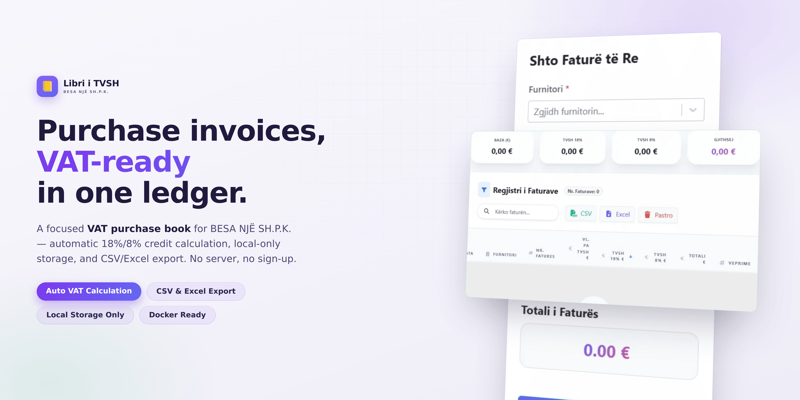
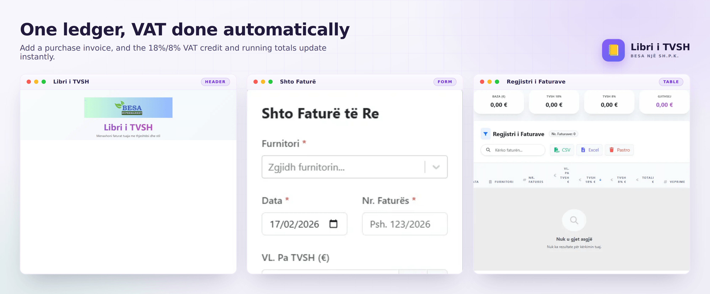


## Statusi i Projektit

> [!WARNING]
> **KUJDES:** Ky projekt është ende në zhvillim e sipër (Work in Progress / Unfinished). Mund të ketë ndryshime dhe nuk është gati për t'u përdorur në produksion.

<body>

<h1>LibriTVSH - BESA NJË SH.P.K.</h1>

<strong>LibriTVSH</strong> është një aplikacion web i krijuar posaçërisht për nevojat e <strong>BESA NJË SH.P.K.</strong>, për të ruajtur dhe menaxhuar detajet kryesore të faturave të blerjes (Libri i Blerjes për TVSH).

    

Ky aplikacion ndihmon në regjistrimin e saktë të të dhënave të nevojshme dhe ruajtjen e tyre, duke u fokusuar ekskluzivisht te faturat e blerjes së biznesit tonë.

<h2>Aplikacioni Live</h2>
    
Përdorni aplikacionin direkt këtu: <a href="https://libritvsh.rilindkycyku.dev/" target="_blank">https://libritvsh.rilindkycyku.dev/</a>

<h2>Ekzekutimi me Docker</h2>
    
Ky projekt mbeshtet ekzekutimin me Docker! Per te ngritur aplikacionin pa pasur nevoje per <code>npm</code> apo Node.js lokalisht, ndiqni keto hapa:

    <ol>
        <li>Sigurohuni qe keni <strong>Docker Desktop</strong> te instaluar.</li>
        <li>Hyni ne folderin <code>libri-tvsh</code>:
            <pre><code>cd LibriTVSH/libri-tvsh</code></pre>
        </li>
        <li>Ekzekutoni komanden:
            <pre><code>docker compose up -d --build</code></pre>
        </li>
        <li>Hapni <a href="http://localhost:3300" target="_blank">http://localhost:3300</a> ne shfletuesin tuaj.</li>
    </ol>

<h2>Si të instaloni dhe ekzekutoni lokalisht</h2>
    <ol>
        <li>Klononi repository-n:
            <pre><code>git clone https://github.com/rilindkycyku/LibriTVSH.git</code></pre>
        </li>
        <li>Hyni në folderin e projektit:
            <pre><code>cd LibriTVSH/libri-tvsh</code></pre>
        </li>
        <li>Instaloni dependencat:
            <pre><code>npm install</code></pre>
        </li>
        <li>Nisni serverin e zhvillimit:
            <pre><code>npm run dev</code></pre>
        </li>
        <li>Hapni <a href="http://localhost:5173" target="_blank">http://localhost:5173</a> në shfletuesin tuaj.</li>
    </ol>

<h2>Si të bëni build për production</h2>
    <ol>
        <li>Ekzekutoni:
            <pre><code>npm run build</code></pre>
        </li>
        <li>Rezultati do të gjendet në folderin <code>dist</code>, të cilin mund ta deploy-oni në çdo hosting statik.</li>
    </ol>

<h2>Veçoritë kryesore</h2>
    <ul>
        <li>Shtimi, editimi dhe fshirja e regjistrimeve të faturave të blerjes</li>
        <li>Plotësim automatik i prefiksit të <strong>Nr. Faturës</strong> sipas furnitorit të zgjedhur</li>
        <li>Llogaritje automatike e TVSH-së kredite</li>
        <li>Ruajtja e të dhënave lokalisht në shfletues (LocalStorage)</li>
        <li>Eksportimi i të dhënave në format CSV</li>
        <li>Ndërfaqe e thjeshtë dhe intuitive, e optimizuar për përdorim në desktop dhe mobile</li>
        <li>Pa nevojë për regjistrim ose server</li>
    </ul>

<h2>Prefikset e Nr. Faturës</h2>

Shumica e furnitorëve e nisin numrin e faturës gjithmonë njësoj. Kur zgjidhet furnitori, fusha <strong>Nr. Faturës</strong> mbushet vetë me atë pjesë fikse dhe mbetet vetëm pjesa ndryshuese për t'u shkruar — psh. për <em>Buçaj SH.P.K.</em> plotësohet <code>F-26-DSD-FE1-</code>.

<ul>
    <li>Viti merret nga <strong>data e faturës</strong>, jo nga dita e sotme. Nëse ndryshohet data, prefiksi rifreskohet vetë dhe pjesa e shkruar ruhet.</li>
    <li>Furnitorët që përdorin më shumë se një format (psh. <em>Buçaj</em>: <code>F-{YY}-DSD-FE1-</code> dhe <code>FDM-{YY}-</code>) shfaqin butona të vegjël nën fushë për të ndërruar prefiksin me një klikim.</li>
    <li>Nëse numri shkruhet me dorë, aplikacioni nuk e mbishkruan.</li>
</ul>

Lista mbahet te <code>libri-tvsh/public/prefikset.json</code> dhe mund të redaktohet pa u bërë build i ri, njësoj si <code>furnitori.json</code>:

<pre><code>{
  "key": 22,
  "Name": "Buçaj SH.P.K.",
  "prefikset": [
    { "prefiksi": "F-{YY}-DSD-FE1-", "shembull": "F-26-DSD-FE1-02307", "perdorime": 37 },
    { "prefiksi": "FDM-{YY}-",       "shembull": "FDM-26-00179462",    "perdorime": 17 }
  ]
}</code></pre>

<ul>
    <li><code>key</code> / <code>Name</code> — duhet të përputhen me një zë të <code>furnitori.json</code> (<code>key</code> ka përparësi; emri përdoret si rezervë).</li>
    <li><code>prefiksi</code> — teksti fiks; <code>{YY}</code> zëvendësohet me vitin dyshifror dhe <code>{YYYY}</code> me vitin katërshifror.</li>
    <li><code>shembull</code> — një numër i plotë real, shfaqet si ndihmë (placeholder / tooltip).</li>
    <li><code>perdorime</code> — sa herë është hasur ky format; përcakton radhën, i pari plotësohet automatikisht.</li>
</ul>

<h2>Pamja e LibriTVSH</h2>

Ky aplikacion është zhvilluar dhe mirëmbahet ekskluzivisht për përdorim nga <strong>BESA NJË SH.P.K.</strong>.

</body>

## Të Drejtat e Autorit (Copyright & License)

Ky projekt është pronë intelektuale e **Rilind Kyçyku**. Nuk lejohet përdorimi, kopjimi, modifikimi apo shpërndarja e këtij kodi pa pëlqimin paraprak dhe miratimin me shkrim nga autori. Çdo përdorim i paautorizuar është rreptësisht i ndaluar.
